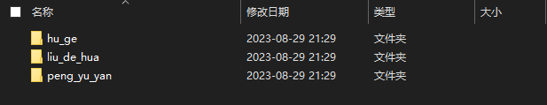
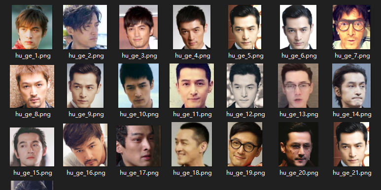
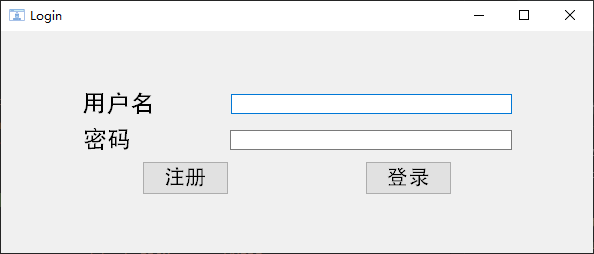
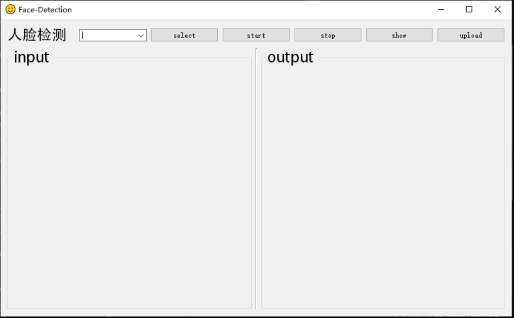
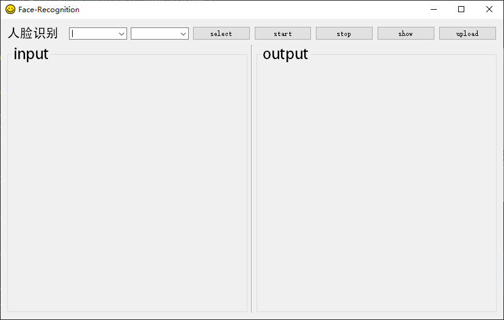

# 基于 YOLOV5s + ArcFace/FaceNet 的人脸识别系统

## 1.Introduction
本系统基于 YOLOV5s + ArcFace/FaceNet 实现人脸识别功能，YOLOV5s 模型用于人脸检测，使用 ArcFace/FaceNet 实现人脸识别，
并利用 PySide2 + Qt Designer 设计系统UI。

## 2.Run in terminal
```sh
    python login.py
    python window.py  # 如果不需要将识别结果upload至数据库，可以直接运行window.py
```

## 3.Project structure

`arcface`            -- ArcFace网络相关文件  
`facenet`            -- FaceNet权重以及关键函数**facenet.py**  
`inference`  
&nbsp;&nbsp;&nbsp;&nbsp;&nbsp;&nbsp;&nbsp;&nbsp;    - `input`        -- 用于 test 的 image 或者 video  
&nbsp;&nbsp;&nbsp;&nbsp;&nbsp;&nbsp;&nbsp;&nbsp;    - `output`       -- 运行结果保存目录  
`pic`                -- 用于 ArcFace 的训练集  
`ui`                 -- 使用Qt Designer 绘制的系统UI  
&nbsp;&nbsp;&nbsp;&nbsp;&nbsp;&nbsp;&nbsp;&nbsp;    - `icons`        -- 用于存放UI界面的icons
`utils`              -- 关键函数  
`weights`            -- 模型权重文件  
`yolov5_ultralytics` -- yolov5s模型  
`detect_arcface.py`  -- 基于YOLOV5s+arcface的人脸识别  
`detect_face.py`     -- 基于YOLOV5s的人脸检测  
`detect_facenet.py`  -- 基于YOLOV5s+facenet的人脸识别  
`login.py`           -- 系统的入口函数  
`open_Gauss.py`      -- 用于连接数据库  
`window.py`          -- 人脸识别系统运行主要逻辑  


## How to run
### 1.preparations  
(1) 下载weights文件，`weights/weights.txt`  
(2) 生成facenet识别人脸所需的`Database.npz`和`SVCmodel.pkl`，具体步骤请参考 https://blog.csdn.net/qq_41334243/article/details/107425492  
(3) 制作ArcFace训练集，即`pic`文件夹下的文件，文件夹结构如图所示，每个文件夹下存储人物面部照片,可以用`utils/name2.py or name2order.py`修改图片命名，文件夹与图片命名格式如下：
<div align="center">


</div> 
(4) 如果想将识别结果上传至数据库中，请修改`open_Gauss.py`文件中的数据库连接信息,如果不想使用数据库，直接运行`window.py`即可

## Inferences
https://blog.csdn.net/qq_41334243/article/details/107425492  
https://blog.csdn.net/weixin_41809530/article/details/107313752  
https://github.com/BlackFeatherQQ/FaceRecognition?login=from_csdn  
https://github.com/ultralytics/yolov5 


## TODO
1. 提高人脸识别的准确率
2. 提高系统的流畅度
3. 可以实时显示人脸识别结果


## Demo show
<div align="center">



</div>

